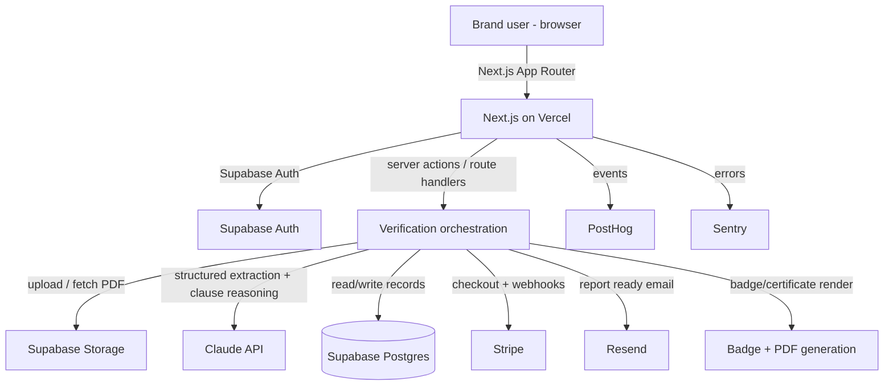

# PRD — alkatera LCA Verifier

> Visual tokens not yet defined. Run the Design System skill to generate `docs/design.md` before UI implementation begins. The example alkatera LCA report is a strong visual reference (dark cover, light interior, lime-green accent, serif display headings, monospace labels).

## 1. Overview

### Product Summary

**alkatera LCA Verifier** — Independent LCA verification that shows its working. The Verifier ingests a Life Cycle Assessment from any platform, checks it against the international standards the user selects, re-cross-checks its core calculations, and returns a tiered certification (Bronze / Silver / Gold) with a plain-English, clause-by-clause findings list. Every grade is traced to the exact standard and clause behind it. It is platform-agnostic, low-cost, and fiercely transparent, and it will fail alkatera's own reports when they fall short.

### Objective

This PRD covers the MVP as defined in `docs/product-vision.md` § Product Strategy. In scope: LCA PDF upload and structured extraction; user-selectable standards; a verification engine that re-checks calculations and produces clause-cited findings; tiered certification with transparent reasoning; a free basic check versus a paid full report plus verification badge and certificate; accounts and verification history. Out of scope for v1: direct alkatera API ingestion, human-in-the-loop critical review, non-PDF ingestion, LCA re-modelling from raw inventory, and a public verification directory.

### Market Differentiation

The technical implementation must deliver what neither slow human review nor a platform's own self-check can: an independent verdict in minutes, on an LCA from any source, with every finding citing its standard and clause. Concretely, this demands (1) robust structured extraction from heterogeneous third-party PDFs, (2) an encoded, auditable rules layer mapping standard clauses to checks, and (3) plain-English rendering of rigorous findings. Transparency is the moat, so the system must never surface a grade without its underlying, cited reasoning.

### Magic Moment

A brand uploads their LCA, selects standards, and within minutes sees a clear certification tier and a plain-English, clause-by-clause list of what passed, what failed, and how to fix it. What must be fast: extraction and evaluation (target under a few minutes end to end). What must be seamless: the land → upload → select → result path, with no LCA expertise required. What must work perfectly: the citation of a real clause behind every finding, and never a false pass.

### Success Criteria

- Time to result under 3 minutes (p95) from upload to rendered verdict.
- The land → upload → select standards → result flow completes with zero steps that require LCA expertise.
- Every finding renders with a standard reference and clause identifier; no uncited verdicts.
- Verification engine catches 100% of planted major errors and produces zero false passes across the seed test suite of known-good and known-flawed LCAs.
- All P0 functional requirements implemented with test coverage on the extraction and rules layers.
- Free result page reachable without payment; paid report and badge gated by Stripe.

## 2. Technical Architecture

### Architecture Overview



### Chosen Stack

| Layer | Choice | Rationale |
|---|---|---|
| Frontend | Next.js (App Router) + TypeScript | Best-in-class for web apps with server-side document processing; strong AI coding-tool support; deploys cleanly to Vercel |
| Backend | Next.js server actions and route handlers on Vercel | Colocated with the frontend; serverless; handles PDF ingestion and verification orchestration without separate infrastructure |
| Database | Supabase (Postgres) | Stores verification records, standards definitions, findings, and certification history; SQL suits auditable, structured data |
| Auth | Supabase Auth | Integrated with the database; email and social login; generous free tier keeps running cost low |
| Payments | Stripe | Supports freemium with paid per-verification and report/badge tiers; industry standard, low friction |
| Analytics | PostHog | Free tier covers early volume; funnels and feature flags optimise the free-to-paid path |
| Email | Resend | Transactional email for auth, verification-complete notifications, and report delivery; clean fit with Next.js |
| Error tracking | Sentry | Catch production issues early on a lean, single-maintainer product |

Verification/analysis engine: **Claude API (Anthropic)** — strongest at nuanced standards interpretation and structured reasoning, which is the core of the product.

### Stack Integration Guide

Setup order: (1) scaffold Next.js with TypeScript, Tailwind, App Router; (2) create the Supabase project, enable Auth, create Postgres schema and Storage bucket `lca-uploads` (private); (3) wire Supabase SSR auth using `@supabase/ssr` with server and browser clients; (4) add the Anthropic SDK for extraction and rules reasoning; (5) add Stripe with a webhook route; (6) add PostHog, Resend, Sentry last.

Known patterns and gotchas:
- Use `@supabase/ssr` (not the legacy auth-helpers) for cookie-based sessions in the App Router. Create separate server and client Supabase instances.
- Long-running verification (extraction + LLM reasoning) can exceed default serverless timeouts. Run verification as an async job: create the record, return immediately, process in a background route with an increased `maxDuration`, and have the client poll status. On Vercel, set `export const maxDuration` on the processing route.
- Store uploaded PDFs in a private Supabase Storage bucket; generate signed URLs for access. Never expose the bucket publicly.
- Stripe webhooks require the raw request body — disable body parsing on that route and verify the signature.
- Enforce Postgres Row Level Security so users can only read their own verifications; use the service-role key only in trusted server code, never in the browser.
- Claude calls for extraction should request structured JSON output and be validated with zod before persistence; treat low extraction confidence as an explicit state, not a silent guess.

Required environment variables: `NEXT_PUBLIC_SUPABASE_URL`, `NEXT_PUBLIC_SUPABASE_ANON_KEY`, `SUPABASE_SERVICE_ROLE_KEY`, `ANTHROPIC_API_KEY`, `STRIPE_SECRET_KEY`, `STRIPE_WEBHOOK_SECRET`, `NEXT_PUBLIC_STRIPE_PUBLISHABLE_KEY`, `NEXT_PUBLIC_POSTHOG_KEY`, `NEXT_PUBLIC_POSTHOG_HOST`, `RESEND_API_KEY`, `SENTRY_DSN`, `NEXT_PUBLIC_APP_URL`.

### Repository Structure

```
alkatera-lca-verifier/
├── src/
│   ├── app/
│   │   ├── (marketing)/            # Public landing, pricing
│   │   ├── (app)/
│   │   │   ├── dashboard/          # Verification history
│   │   │   ├── verify/             # Upload + standards selection + result
│   │   │   └── settings/           # Account
│   │   ├── verify/[id]/            # Result detail (also public share view)
│   │   ├── badge/[id]/             # Public badge + findings page
│   │   └── api/
│   │       ├── verify/process/     # Async verification worker (maxDuration raised)
│   │       ├── verify/status/      # Poll job status
│   │       ├── stripe/webhook/     # Stripe events (raw body)
│   │       └── stripe/checkout/    # Create checkout session
│   ├── components/
│   │   ├── ui/                     # Design system primitives (from docs/design.md)
│   │   └── features/               # Upload, StandardsPicker, FindingsList, TierBadge
│   ├── lib/
│   │   ├── supabase/               # server + browser clients
│   │   ├── extraction/             # PDF → structured LCA (Claude)
│   │   ├── standards/              # Encoded standard clause definitions + checks
│   │   ├── engine/                 # Verification orchestration + scoring/tiering
│   │   ├── report/                 # Report + badge/certificate generation
│   │   └── stripe/                 # Stripe helpers
│   └── types/                      # Shared TS types + zod schemas
├── supabase/
│   └── migrations/                 # SQL migrations
├── tests/
│   ├── fixtures/                   # Known-good / known-flawed LCA PDFs
│   └── engine/                     # Rules + scoring tests
├── public/
└── ...
```

### Infrastructure & Deployment

Deploy to Vercel (production + preview deployments per branch). Supabase hosts Postgres, Auth, and Storage. Configure all environment variables in Vercel and locally in `.env.local`. Apply database changes via SQL migration files in `supabase/migrations/` (post each migration's SQL in chat for manual application in the Supabase SQL editor). Raise `maxDuration` on the verification worker route to accommodate extraction plus LLM reasoning. CI: run type-check, lint, and the engine test suite on pull requests before deploy.

### Security Considerations

- Auth via Supabase (cookie sessions with `@supabase/ssr`); protect all `(app)` routes server-side.
- Enforce Row Level Security on every user-owned table so users read only their own records; service-role key confined to server code.
- Uploaded PDFs live in a private bucket accessed via short-lived signed URLs; validate file type and size before storage.
- Validate all inputs (uploads, standards selection, API bodies) with zod; treat extraction output as untrusted until validated.
- Stripe webhook signature verification; never trust client-reported payment status.
- Rate-limit upload and verification endpoints to control abuse and LLM cost.
- Configure Sentry to scrub PII and secrets from events and breadcrumbs; error payloads must never leak tokens, API keys, uploaded content, or personal data.
- Output wording must be carefully scoped ("checked against clause X" rather than "certified fit for all claims") to limit liability; legal review of verdict language before public launch.

### Cost Estimate

At under 1,000 users for the first six months:

- **Vercel:** Hobby free tier likely sufficient early; Pro (~$20/mo) if background durations or bandwidth require it.
- **Supabase:** Free tier (500MB DB, 1GB storage, 50k MAU auth) covers early scale; Pro (~$25/mo) when storage or compute grows.
- **Anthropic Claude API:** The main variable cost. Extraction + reasoning per verification; budget efficient prompting and caching of standards logic. Estimate low tens of dollars per month at early volume; monitor closely given the low-cost mandate.
- **Stripe:** No monthly fee; ~2.9% + fixed per transaction.
- **PostHog:** Free up to 1M events/mo.
- **Resend:** Free up to 3,000 emails/mo.
- **Sentry:** Free developer tier covers early error volume.

Estimated fixed monthly cost early: roughly $0–$70 plus usage-based Claude spend. Keeping Claude cost per verification low is the key lever.

## 3. Data Model

### Entity Definitions

```sql
-- profiles (mirrors Supabase auth.users)
CREATE TABLE profiles (
  id UUID PRIMARY KEY REFERENCES auth.users(id) ON DELETE CASCADE,
  email VARCHAR(255) NOT NULL,
  display_name VARCHAR(255),
  company_name VARCHAR(255),
  created_at TIMESTAMPTZ NOT NULL DEFAULT NOW()
);

-- standards (encoded catalogue of standards the verifier supports)
CREATE TABLE standards (
  id UUID PRIMARY KEY DEFAULT gen_random_uuid(),
  code VARCHAR(50) NOT NULL UNIQUE,      -- e.g. 'ISO_14044', 'ISO_14067'
  name VARCHAR(255) NOT NULL,            -- e.g. 'ISO 14044:2006'
  category VARCHAR(50) NOT NULL,         -- 'iso' | 'ghg' | 'global'
  description TEXT,
  is_active BOOLEAN NOT NULL DEFAULT TRUE
);

-- standard_clauses (individual checkable requirements within a standard)
CREATE TABLE standard_clauses (
  id UUID PRIMARY KEY DEFAULT gen_random_uuid(),
  standard_id UUID NOT NULL REFERENCES standards(id) ON DELETE CASCADE,
  clause_ref VARCHAR(50) NOT NULL,       -- e.g. '4.2.3.6'
  title VARCHAR(255) NOT NULL,           -- e.g. 'Data quality requirements'
  check_description TEXT NOT NULL,       -- what a conforming study must show
  severity VARCHAR(20) NOT NULL DEFAULT 'major',  -- 'major' | 'minor'
  UNIQUE (standard_id, clause_ref)
);

-- verifications (one per uploaded LCA run)
CREATE TABLE verifications (
  id UUID PRIMARY KEY DEFAULT gen_random_uuid(),
  user_id UUID NOT NULL REFERENCES profiles(id) ON DELETE CASCADE,
  product_name VARCHAR(255),             -- extracted from LCA
  source_platform VARCHAR(255),          -- e.g. 'alkatera', 'unknown'
  file_path TEXT NOT NULL,               -- Supabase Storage path
  selected_standard_ids UUID[] NOT NULL, -- standards chosen by user
  status VARCHAR(30) NOT NULL DEFAULT 'pending', -- pending|extracting|evaluating|complete|failed
  extraction JSONB,                      -- structured LCA data
  extraction_confidence NUMERIC,         -- 0..1
  tier VARCHAR(20),                      -- 'bronze'|'silver'|'gold'|null
  score NUMERIC,                         -- 0..100
  is_paid BOOLEAN NOT NULL DEFAULT FALSE,
  created_at TIMESTAMPTZ NOT NULL DEFAULT NOW(),
  completed_at TIMESTAMPTZ
);

-- findings (one per evaluated clause for a verification)
CREATE TABLE findings (
  id UUID PRIMARY KEY DEFAULT gen_random_uuid(),
  verification_id UUID NOT NULL REFERENCES verifications(id) ON DELETE CASCADE,
  standard_id UUID NOT NULL REFERENCES standards(id),
  clause_ref VARCHAR(50) NOT NULL,
  result VARCHAR(20) NOT NULL,           -- 'conforms'|'minor_gap'|'major_gap'|'insufficient_info'
  plain_summary TEXT NOT NULL,           -- plain-English finding
  reasoning TEXT NOT NULL,               -- cited justification
  recommendation TEXT,                   -- how to fix, if not conforming
  created_at TIMESTAMPTZ NOT NULL DEFAULT NOW()
);

-- calculation_checks (recomputed values cross-checked against the report)
CREATE TABLE calculation_checks (
  id UUID PRIMARY KEY DEFAULT gen_random_uuid(),
  verification_id UUID NOT NULL REFERENCES verifications(id) ON DELETE CASCADE,
  check_name VARCHAR(255) NOT NULL,      -- e.g. 'GHG total reconciliation'
  reported_value NUMERIC,
  recomputed_value NUMERIC,
  unit VARCHAR(50),
  passed BOOLEAN NOT NULL,
  tolerance_note TEXT
);

-- badges (public verification artefacts, paid tier)
CREATE TABLE badges (
  id UUID PRIMARY KEY DEFAULT gen_random_uuid(),
  verification_id UUID NOT NULL UNIQUE REFERENCES verifications(id) ON DELETE CASCADE,
  public_slug VARCHAR(64) NOT NULL UNIQUE,
  tier VARCHAR(20) NOT NULL,
  issued_at TIMESTAMPTZ NOT NULL DEFAULT NOW()
);

-- payments (Stripe records)
CREATE TABLE payments (
  id UUID PRIMARY KEY DEFAULT gen_random_uuid(),
  user_id UUID NOT NULL REFERENCES profiles(id) ON DELETE CASCADE,
  verification_id UUID REFERENCES verifications(id) ON DELETE SET NULL,
  stripe_session_id VARCHAR(255) NOT NULL,
  amount_total INTEGER,                  -- minor units
  currency VARCHAR(10),
  status VARCHAR(30) NOT NULL,           -- 'paid'|'failed'|'refunded'
  created_at TIMESTAMPTZ NOT NULL DEFAULT NOW()
);
```

### Relationships

- `profiles` 1:many `verifications` (cascade delete).
- `verifications` 1:many `findings`, 1:many `calculation_checks` (cascade delete).
- `verifications` 1:1 `badges` (paid only; cascade delete).
- `standards` 1:many `standard_clauses` (cascade delete).
- `verifications.selected_standard_ids` references `standards` (array; app-enforced).
- `profiles` 1:many `payments`; `payments` optionally links to a `verification`.

### Indexes

- `verifications(user_id, created_at DESC)` — dashboard history queries.
- `verifications(status)` — worker picks up pending jobs.
- `findings(verification_id)` — render a result's findings.
- `calculation_checks(verification_id)` — render calculation cross-checks.
- `standard_clauses(standard_id)` — load clauses for selected standards.
- `badges(public_slug)` — public badge lookup.
- `payments(stripe_session_id)` — webhook reconciliation.

## 4. API Specification

### API Design Philosophy

REST-style route handlers plus Next.js server actions. Auth via Supabase cookie session (server-side). Long-running verification is async: create → poll. Error format: `{ error: string, details?: unknown }`. No pagination needed at MVP scale beyond a simple `limit`/`offset` on history.

### Endpoints

```
POST /api/verify
Auth: Required
Body (multipart): file (PDF), selectedStandardCodes: string[]
Action: validate + store PDF, create verification (status=pending), enqueue processing
Response 201: { id: string, status: "pending" }
Response 400: { error: "Invalid file or standards" }
Response 401: { error: "Unauthorized" }

POST /api/verify/process        (internal worker, raised maxDuration)
Body: { verificationId: string }
Action: extract (Claude) → validate → evaluate clauses + calculation checks → score + tier → persist
Response 200: { status: "complete" | "failed" }

GET /api/verify/status?id={id}
Auth: Required (owner)
Response 200: { id, status, tier?, score?, extractionConfidence? }

GET /api/verify/{id}
Auth: Required (owner) OR public if a badge exists (limited fields)
Response 200: { id, productName, tier, score, findings[], calculationChecks[], isPaid }

GET /api/verifications           # history
Auth: Required
Query: limit?, offset?
Response 200: { items: VerificationSummary[], total: number }

POST /api/stripe/checkout
Auth: Required
Body: { verificationId: string }
Response 200: { checkoutUrl: string }

POST /api/stripe/webhook         # raw body, signature-verified
Events: checkout.session.completed → mark payment paid, verification.is_paid=true, issue badge
Response 200: { received: true }

GET /api/badge/{publicSlug}      # public
Response 200: { tier, productName, issuedAt, findingsSummary[] }
```

Standards are read at page load via a server action `getActiveStandards()` returning the catalogue grouped by category.

## 5. User Stories

### Epic: Verification

**US-001: Upload an LCA**
As Sophie (Head of Brand), I want to upload my LCA PDF so that I can have it independently checked.
Acceptance Criteria:
- [ ] Given I am logged in, when I drop a PDF and submit, then a verification is created and processing starts.
- [ ] Given a non-PDF or oversized file, when I submit, then I see a clear validation error.
- [ ] Edge case: corrupt/unreadable PDF → verification fails with a plain-English reason.

**US-002: Select standards**
As Sophie, I want to choose which standards to verify against so that the check matches my regulatory context.
Acceptance Criteria:
- [ ] Given the upload step, when I view standards, then I see them grouped (ISO, GHG, global) and can multi-select.
- [ ] Given no selection, when I try to proceed, then I am prompted to select at least one.

**US-003: See a transparent result**
As Sophie, I want a clear tier and clause-by-clause findings so that I know where my LCA stands and what to fix.
Acceptance Criteria:
- [ ] Given processing completes, when I open the result, then I see a Bronze/Silver/Gold tier and a score.
- [ ] Given the result, when I read any finding, then it shows the standard, clause, plain summary, reasoning, and (if not conforming) a recommendation.
- [ ] Edge case: low extraction confidence → the result flags reduced reliability rather than asserting a false verdict.

**US-004: Upgrade for report and badge**
As Sophie, I want to buy the full report and badge so that I can publish proof of verification.
Acceptance Criteria:
- [ ] Given a free result, when I upgrade and pay, then a downloadable report and a public badge are generated.
- [ ] Given payment fails, when I return, then my free result is intact and I can retry.

### Epic: Account & History

**US-005: Review past verifications**
As Sophie, I want a history of my verifications so that I can revisit results.
Acceptance Criteria:
- [ ] Given I am logged in, when I open the dashboard, then I see my past verifications with product name, date, and tier.
- [ ] Given I open a past verification, then its findings render without re-running.

### Epic: Public Trust

**US-006: Share a verification badge**
As Sophie, I want a public badge page so that buyers and journalists can see my verification and its basis.
Acceptance Criteria:
- [ ] Given a paid verification, when someone visits the badge URL, then they see the tier and a findings summary (no private account data).

## 6. Functional Requirements

**FR-001: LCA PDF ingestion**
Priority: P0
Description: Accept a PDF upload, validate type and size, store in a private bucket, create a verification record.
Acceptance Criteria: Valid PDFs stored and recorded; invalid files rejected with clear errors.
Related Stories: US-001

**FR-002: Structured extraction**
Priority: P0
Description: Use Claude to extract structured LCA data (product, boundaries, impact totals, lifecycle breakdown, GHG split, data quality, allocation, EoL) into a zod-validated object with a confidence score.
Acceptance Criteria: The alkatera example report extracts into the expected schema; low-confidence extractions are flagged.
Related Stories: US-001, US-003

**FR-003: Standards selection**
Priority: P0
Description: Present the active standards catalogue grouped by category and let the user multi-select which drive evaluation.
Acceptance Criteria: Selection persists on the verification and determines which clauses are evaluated.
Related Stories: US-002

**FR-004: Clause-level evaluation engine**
Priority: P0
Description: For each selected standard's clauses, evaluate the extracted LCA and produce a finding (conforms / minor_gap / major_gap / insufficient_info) with cited reasoning and a recommendation.
Acceptance Criteria: Every clause yields exactly one finding with a citation; planted errors in the test suite are caught.
Related Stories: US-003

**FR-005: Calculation cross-checks**
Priority: P0
Description: Recompute and reconcile core figures (e.g. GHG species total vs headline, lifecycle-stage sum, fossil/biogenic split, net EoL) against the report within tolerance.
Acceptance Criteria: Mismatches beyond tolerance produce failed checks surfaced in the result.
Related Stories: US-003

**FR-006: Scoring and tiering**
Priority: P0
Description: Roll findings and calculation checks into a 0–100 score and a Bronze/Silver/Gold tier via a transparent, documented rubric.
Acceptance Criteria: A tier is never shown without its contributing findings; the rubric is deterministic given the same findings.
Related Stories: US-003

**FR-007: Free vs paid gating**
Priority: P0
Description: Free tier shows the tier and findings summary; paid unlocks the full downloadable report and public badge, gated by Stripe.
Acceptance Criteria: Unpaid users cannot access the full report/badge; paid users can.
Related Stories: US-004

**FR-008: Report and badge generation**
Priority: P0
Description: Generate a branded PDF verification report and a public badge/certificate with a shareable slug.
Acceptance Criteria: Paid verification yields a downloadable report and a resolvable public badge page.
Related Stories: US-004, US-006

**FR-009: Accounts and history**
Priority: P0
Description: Supabase auth; dashboard lists a user's verifications; individual results retrievable.
Acceptance Criteria: Users see only their own verifications; history renders past results.
Related Stories: US-005

**FR-010: Async job status polling**
Priority: P0
Description: Client polls verification status during extraction/evaluation and transitions to the result on completion.
Acceptance Criteria: Status progresses pending → extracting → evaluating → complete/failed and the UI reflects it.
Related Stories: US-001, US-003

**FR-011: Global frameworks as selectable standards**
Priority: P1
Description: Add SBTi, CDP, and EU Green Claims Directive to the standards catalogue as selectable options.
Acceptance Criteria: These appear under the global category and drive relevant clause checks.
Related Stories: US-002

**FR-012: Email report delivery**
Priority: P1
Description: On paid completion, email the user a link to their report via Resend.
Acceptance Criteria: A completion email is sent and links to the report.
Related Stories: US-004

**FR-013: Public badge page**
Priority: P1
Description: A public, read-only page rendering the badge tier and a findings summary from a slug.
Acceptance Criteria: Reachable without auth; exposes no private account data.
Related Stories: US-006

## 7. Non-Functional Requirements

### Performance
- Time from upload to rendered result under 3 minutes (p95).
- Marketing and result pages LCP under 2.5s on a typical connection.
- Status polling responses under 300ms (p95).

### Security
- OWASP Top 10 addressed; all inputs zod-validated.
- Row Level Security on all user-owned tables.
- Auth sessions via Supabase secure cookies; protected routes enforced server-side.
- Rate limiting on upload, verification, and auth endpoints.
- Sentry scrubs PII, secrets, and uploaded content from events.

### Accessibility
- WCAG 2.1 AA: keyboard navigable, sufficient contrast (verify accent contrast from `docs/design.md`), screen-reader-tested result and findings views.

### Scalability
- Handle at least 50 concurrent verification jobs via async processing without user-visible failure; queue/backpressure if Claude rate limits are hit.

### Reliability
- 99.5% uptime target.
- Graceful degradation: if Claude or a third-party service fails mid-job, the verification is marked failed with a retryable, plain-English message; the user's upload and account are never lost.

## 8. UI/UX Requirements

> Visual tokens not yet defined. Run the Design System skill before implementation begins. Reference component names from `docs/design.md`.

### Screen: Landing
Route: `/`
Purpose: Explain the value, drive to a free verification.
Layout: Hero with headline and primary CTA, how-it-works, pricing summary, footer.
States: static (marketing). Loading: n/a. Error: n/a.
Key Interactions: CTA → sign up / verify.
Components Used: button-primary, card, section headers.

### Screen: Verify (upload + standards)
Route: `/verify`
Purpose: Upload an LCA and select standards.
Layout: Stepper — upload dropzone, then grouped standards multi-select, then submit.
States: Empty (no file), Loading (uploading), Populated (file ready + standards chosen), Error (invalid file / no standards).
Key Interactions: drop PDF → validate → enable standards step; select standards → submit → redirect to result (processing).
Components Used: dropzone, checkbox-group, button-primary, inline-alert.

### Screen: Result / Verification detail
Route: `/verify/[id]`
Purpose: Show tier, score, findings, calculation checks; upsell paid report/badge.
Layout: Header with TierBadge + score, calculation-checks panel, findings list grouped by standard, upgrade CTA (if unpaid).
States: Loading (processing with status text), Populated (verdict), Error (failed job with reason), Low-confidence (banner flagging reduced reliability).
Key Interactions: expand a finding → see reasoning + recommendation; upgrade → Stripe checkout.
Components Used: tier-badge, finding-item, table (calc checks), button-primary, banner.

### Screen: Dashboard / History
Route: `/dashboard`
Purpose: List past verifications.
Layout: Table/cards of verifications (product, date, tier, paid status).
States: Empty ("No verifications yet. Upload your first LCA..."), Loading (skeleton rows), Populated, Error.
Key Interactions: click row → open result.
Components Used: card, table, tier-badge, empty-state.

### Screen: Settings / Account
Route: `/settings`
Purpose: Manage profile and view billing history.
Layout: Profile form, payment history list.
States: Populated, Loading, Error.
Components Used: input-text, button-primary, table.

### Public: Badge page
Route: `/badge/[slug]`
Purpose: Public proof of verification.
Layout: Large tier badge, product name, issue date, findings summary, link to alkatera.
States: Populated, Not found.
Components Used: tier-badge, card, findings-summary.

### Modal: Standards info
Trigger: info icon on a standard.
Purpose: Explain what a standard covers before selection.
States: open/closed.
Components Used: dialog, prose.

## 9. Auth Implementation

### Auth Flow
Email/password and social login via Supabase Auth using `@supabase/ssr`. On sign-up, create a matching `profiles` row (via trigger or post-signup server action). Cookie-based sessions read on the server for protected routes.

### Provider Configuration
Create browser and server Supabase clients. Configure allowed redirect URLs. Enable email auth and at least one social provider (e.g. Google) if desired. Store keys in env vars (`NEXT_PUBLIC_SUPABASE_URL`, `NEXT_PUBLIC_SUPABASE_ANON_KEY`, `SUPABASE_SERVICE_ROLE_KEY`).

### Protected Routes
Wrap the `(app)` route group with a server-side session check; redirect unauthenticated users to sign-in. Use middleware to refresh sessions.

### User Session Management
Sessions via secure HTTP-only cookies managed by `@supabase/ssr`; refresh in middleware. Access the user in server components via the server client; in client components via the browser client.

### Role-Based Access
MVP has a single role (authenticated user). Ownership is enforced by RLS (`user_id = auth.uid()`). An `admin` capability may be added later for internal QA review of flagged verifications.

## 10. Payment Integration

### Payment Flow
One-time payment per verification to unlock the full report and badge (freemium: free check, paid unlock). From a free result, the user starts checkout, pays via Stripe Checkout, and the webhook marks the verification paid and issues a badge.

### Provider Setup
Create a Stripe product/price for the paid unlock (keep the price deliberately low per the low-cost mandate). Store `STRIPE_SECRET_KEY`, `STRIPE_WEBHOOK_SECRET`, `NEXT_PUBLIC_STRIPE_PUBLISHABLE_KEY`.

### Pricing Model Implementation
`POST /api/stripe/checkout` creates a Checkout Session for the paid-unlock price, referencing `verificationId` in metadata. Consider a future subscription tier for consultants (out of MVP scope).

### Webhook Handling
`POST /api/stripe/webhook` with raw body and signature verification. On `checkout.session.completed`: record the payment, set `verifications.is_paid = true`, generate the badge, and trigger the report email.

### Subscription Management
Not in MVP (one-time unlocks only). If a subscription tier is added, use the Stripe customer portal for management.

### Testing
Use Stripe test mode and the Stripe CLI to forward and replay webhook events locally.

## 11. Edge Cases & Error Handling

### Feature: Upload & Extraction
| Scenario | Expected Behavior | Priority |
|---|---|---|
| Non-PDF or oversized file | Reject before storage with a clear message | P0 |
| Corrupt / image-only PDF | Verification fails with a plain reason; suggest re-export | P0 |
| Extraction low confidence | Complete but flag reduced reliability; never assert a false verdict | P0 |
| Non-LCA PDF uploaded | Detect missing LCA fields → fail with "this does not look like an LCA report" | P1 |

### Feature: Verification Engine
| Scenario | Expected Behavior | Priority |
|---|---|---|
| Claude API timeout/error mid-job | Mark failed, retryable; preserve upload | P0 |
| Missing data for a clause | Finding = insufficient_info with explanation, not a pass | P0 |
| Calculation mismatch | Failed calculation_check surfaced in result | P0 |

### Feature: Payments
| Scenario | Expected Behavior | Priority |
|---|---|---|
| Payment fails/cancelled | Free result intact; user can retry | P0 |
| Webhook received twice | Idempotent handling (no duplicate badge/payment) | P0 |
| Webhook signature invalid | Reject 400; do not mutate state | P0 |

### Feature: Auth & Access
| Scenario | Expected Behavior | Priority |
|---|---|---|
| Session expires mid-session | Redirect to sign-in, preserve intended destination | P0 |
| User requests another user's verification | 404/forbidden via RLS | P0 |
| Public badge for unpaid/deleted verification | Not found | P1 |

## 12. Dependencies & Integrations

### Core Dependencies
```json
{
  "next": "latest",
  "react": "latest",
  "react-dom": "latest",
  "typescript": "latest",
  "@supabase/supabase-js": "latest",
  "@supabase/ssr": "latest",
  "@anthropic-ai/sdk": "latest",
  "stripe": "latest",
  "zod": "latest",
  "react-hook-form": "latest",
  "tailwindcss": "latest",
  "posthog-js": "latest",
  "resend": "latest",
  "@sentry/nextjs": "latest"
}
```
PDF handling: a server-side PDF text/layout extraction library (e.g. `unpdf` or `pdf-parse`) feeding Claude for structured extraction. Report/badge PDF generation: a server-side renderer (e.g. `@react-pdf/renderer` or Playwright-to-PDF).

### Development Dependencies
```json
{
  "eslint": "latest",
  "prettier": "latest",
  "vitest": "latest",
  "@types/node": "latest",
  "@types/react": "latest"
}
```

### Third-Party Services
- **Anthropic Claude API** — extraction + clause reasoning. Env: `ANTHROPIC_API_KEY`. Main usage-based cost; monitor per-verification spend.
- **Supabase** — Postgres, Auth, Storage. Env: `NEXT_PUBLIC_SUPABASE_URL`, `NEXT_PUBLIC_SUPABASE_ANON_KEY`, `SUPABASE_SERVICE_ROLE_KEY`.
- **Stripe** — payments. Env: `STRIPE_SECRET_KEY`, `STRIPE_WEBHOOK_SECRET`, `NEXT_PUBLIC_STRIPE_PUBLISHABLE_KEY`.
- **PostHog** — analytics/funnels. Env: `NEXT_PUBLIC_POSTHOG_KEY`, `NEXT_PUBLIC_POSTHOG_HOST`. Free to 1M events/mo.
- **Resend** — transactional email. Env: `RESEND_API_KEY`. Free to 3,000 emails/mo.
- **Sentry** — error tracking. Env: `SENTRY_DSN`. Free developer tier; configure PII scrubbing.

## 13. Out of Scope

- **Direct alkatera API ingestion** — couples MVP to one platform and delays platform-agnostic proof. Reconsider once PDF ingestion is proven (within a few months post-launch).
- **Human-in-the-loop formal ISO 14044 critical review** — reintroduces the cost and latency the product exists to escape. Reconsider if a premium human-backed tier shows clear demand.
- **Non-PDF / non-LCA document types and multi-language** — deferred until core demand is proven.
- **LCA re-modelling from raw inventory** — the verifier checks, alkatera builds; conflating them blurs independence. Not this time.
- **Public verification directory / marketplace** — premature; reconsider after a critical mass of verified reports.

## 14. Open Questions

- **How is the clause rules layer authored?** Options: (a) fully encoded per-clause deterministic checks, (b) LLM-driven evaluation guided by encoded clause descriptions, (c) hybrid. Tradeoff: determinism/auditability vs coverage/effort. Recommended default: hybrid — deterministic checks for calculation reconciliation and structural clauses, LLM-guided evaluation (with cited clause descriptions) for qualitative clauses, always requiring a citation.
- **Exact tiering rubric.** How many/which major gaps cap a tier? Recommended default: any unresolved major gap caps at Bronze; zero major gaps + limited minor gaps = Silver; zero major, minimal minor, and strong data quality = Gold. Finalise with Tim given his LCA expertise.
- **Paid unlock price point.** Recommended default: a low flat fee per verification (test £X in launch), consistent with the low-cost mandate; revisit with real conversion data.
- **Liability wording of verdicts.** Needs legal review before public launch; default to strictly scoped language.
- **Extraction library choice.** `unpdf` vs `pdf-parse` vs sending page images to Claude for vision-based extraction. Recommended default: text extraction first, fall back to vision-based extraction for image-heavy/complex layouts.
